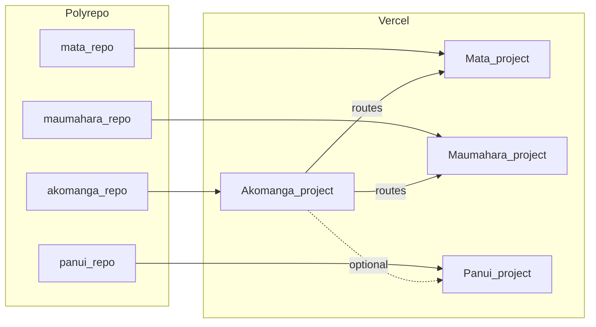

# Git layout for Mata, Maumahara, Pānui vs Akomanga

**Short answer:** Akomanga having its own GitHub repo does **not** force the others to use Git—but each satellite app still needs a **source of truth** and a **Vercel build**. **Polyrepo** (one GitHub repo per app) is a normal choice.

Akomanga repo: [`github.com/PetaKirikiri/akomanga`](https://github.com/PetaKirikiri/akomanga). Architecture for host-level routing: [ECOSYSTEM.md](../ECOSYSTEM.md) and [vercel.json](../vercel.json) (`MATA_DEPLOYMENT_ORIGIN`, `MAUMAHARA_DEPLOYMENT_ORIGIN`, optional Pānui).

## What each app needs

| Need | Why |
|------|-----|
| Deployable source | Vercel builds each project separately. |
| Git (recommended) | Git Integration — push → preview/production. |
| Monorepo alternative | One repo, multiple Vercel projects with different **Root Directory** (not in scope unless you choose it). |

## Your local layout (Coding folder)

Paths under `/Users/petakirikiri/Coding`:

| App | Folder |
|-----|--------|
| Akomanga | `akomanga/` (already has `origin` on GitHub) |
| Mata | `mata/` |
| Maumahara | `maumahara/` |
| Pānui | `pānui/` (also `pānui-backup-20260501/`) |
| Related | `Pūrākau/` — clarify canonical product vs `pānui` before naming repos |

Vercel projects seen earlier include **mata**, **purakau**; Maumahara may need linking when repos exist.

---

## Polyrepo setup: agent capability (through Git / GitHub CLI)

There is **no separate “repo” MCP** inside Cursor for creating GitHub repositories. In **Agent mode**, an agent can do the **same** things you would in a terminal:

| Action | Requirement |
|--------|----------------|
| Create GitHub repos | **`gh repo create`** after **`gh auth login`** on your machine, or `GITHUB_TOKEN` with `repo` scope in the environment. |
| Init / commit / push | **`git`** in each app folder; network for `push`. |
| Inspect existing repos | If `.git` exists, check **`git remote -v`** and history before adding a second remote or force-pushing. |

**Plan-only mode** does not run these commands; it only records the plan.

**Limits:** Cannot create repos without **your** GitHub auth; cannot override org policies, 2FA, or SSH/HTTPS setup you have not configured.

**Safe default when executing:** If a folder already has a remote with commits, **do not** blindly `gh repo create --push` until you confirm whether to connect an **existing** empty repo or migrate history.

---

## When to execute

1. Switch Cursor to **Agent** (not Plan-only).
2. State visibility: open **multi-root workspace** or ensure the agent can run commands under `~/Coding/mata`, `maumahara`, `pānui`.
3. Explicit ask, e.g.: *Create private GitHub repos for mata, maumahara, pānui and push initial commit* — plus **repo naming** (e.g. `panui` vs Unicode) and **private vs public**.

No Akomanga code changes are required for polyrepo; Vercel env for deployment origins is configured per [ECOSYSTEM.md](../ECOSYSTEM.md).
