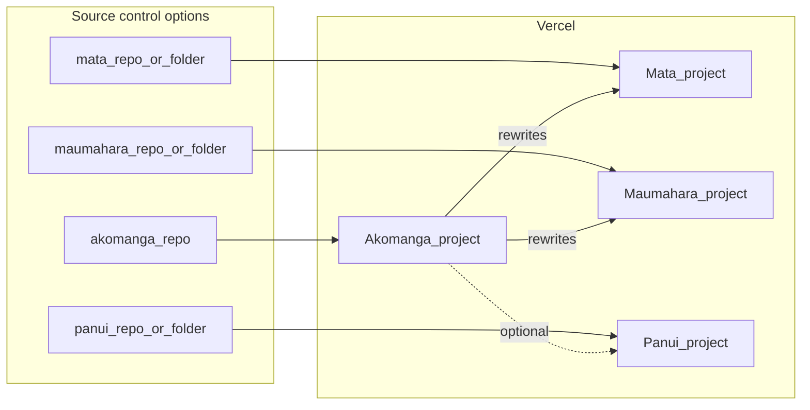

# Akomanga ecosystem base

Akomanga is the **canonical hostname** and student-facing shell. Mata, Maumahara, and optional Pānui (Pūrākau) are separate Vercel projects that are proxied under path prefixes so auth, history, and links stay same-origin in production.

## Vercel (Akomanga project)

1. Attach your **primary domain** to the **Akomanga** project only.
2. On that same project, add environment variables (Production and Preview as needed):

| Variable | Example | Purpose |
|----------|---------|---------|
| `MATA_DEPLOYMENT_ORIGIN` | `https://mata-xxx.vercel.app` | Origin of the Mata deployment (no trailing slash) |
| `MAUMAHARA_DEPLOYMENT_ORIGIN` | `https://maumahara-xxx.vercel.app` | Origin of the Maumahara deployment |
| `PANUI_DEPLOYMENT_ORIGIN` | `https://panui-xxx.vercel.app` | Origin of the Pānui deployment (required for the `/panui` proxy in [`vercel.json`](vercel.json)) |

[`vercel.json`](vercel.json) proxies `/mata`, `/maumahara`, and `/panui` to those origins using [env expansion in routes](https://vercel.com/docs/project-configuration/vercel-json#using-environment-variables-in-routes). Static assets for Akomanga itself are still served from the filesystem first; the catch-all route sends SPA paths to `index.html`.

## One hostname, one Supabase login

Students open **one** production URL (the Akomanga project). To keep **Akomanga**, **Mata**, **Maumahara**, and **Pānui** feeling like one product:

1. Attach the primary domain only to the **Akomanga** Vercel project and set the three `*_DEPLOYMENT_ORIGIN` variables (table above).
2. On **each** satellite Vercel project, use the **same** `VITE_SUPABASE_URL` and `VITE_SUPABASE_ANON_KEY` as Akomanga.
3. On each satellite **Production** build, set the base path so assets and client routing match the proxy:
   - Mata: `VITE_APP_BASE=/mata/`
   - Maumahara: `VITE_APP_BASE=/maumahara/`
   - Pānui: `VITE_APP_BASE=/panui/`
   **Local dev behind the Akomanga shell** (`http://localhost:5174/mata/...`): use the same `VITE_APP_BASE` on the satellite (e.g. from mata run `npm run dev:shell` or `VITE_APP_BASE=/mata/ npm run dev`). Otherwise `index.html` references `/src/main.tsx`, the browser loads the **shell’s** JS from `:5174`, and the portal React app appears on `/mata/...`. Leave base unset only when you open the satellite **alone** on its own port (e.g. `http://localhost:5176/`) without the path proxy.
4. **Supabase Auth URLs** — do this in Dashboard once per environment style (production vs loose previews). See [Deployment checklist](#deployment-checklist-git--vercel) below.

Same origin lets the browser reuse Supabase session storage across `/`, `/mata`, `/maumahara`, and `/panui`.

## Deployment checklist (Git + Vercel)

Use this order when wiring **one Supabase** and **four Git repos** into a single learner-facing URL.

### 1. Supabase Dashboard → Authentication → URL configuration

| Field | What to set |
|-------|-------------|
| **Site URL** | Your **Akomanga** public origin only (production: `https://your-domain.com` or temp: `https://akomanga-xxx.vercel.app`). This is the canonical “return home” URL after auth flows. |
| **Redirect URLs** | At minimum, allow the Akomanga host: `https://akomanga-xxx.vercel.app/**` or `https://your-domain.com/**`. |

**Previews / branch deploys:** If users can complete magic-link or OAuth on Vercel Preview hosts, add patterns that match those hosts (e.g. `https://*.vercel.app/**` for early testing — **tighten** to your team’s naming once stable). If you only ever test auth on **Production** Akomanga, you can omit wildcard previews.

**Bare satellite URLs:** If someone opens `https://mata-xxx.vercel.app` and logs in there, that is a **different origin** than Akomanga — add that host to **Redirect URLs** too, or avoid logging in on bare `*.vercel.app` satellites and always use `/mata` on the Akomanga domain.

### 2. Four Vercel projects (recommended)

| Vercel project | Git repo | Required build env (Production + Preview if you use previews) |
|----------------|-----------|-----------------------------------------------------------------|
| **Akomanga** | `akomanga` | `VITE_SUPABASE_URL`, `VITE_SUPABASE_ANON_KEY`, **`MATA_DEPLOYMENT_ORIGIN`**, **`MAUMAHARA_DEPLOYMENT_ORIGIN`**, **`PANUI_DEPLOYMENT_ORIGIN`** (scheme + host, no trailing slash). Optional: other `VITE_*` from [`.env.example`](.env.example). |
| **Mata** | `mata` | Same Supabase vars; **`VITE_APP_BASE=/mata/`** |
| **Maumahara** | `maumahara` | Same Supabase vars; **`VITE_APP_BASE=/maumahara/`** |
| **Pānui** | `panui` | Same Supabase vars; **`VITE_APP_BASE=/panui/`** |

Import each repo in Vercel, use the framework defaults (Vite: `npm run build`, output `dist`).

### 3. Akomanga routing env (host only)

On the **Akomanga** project, `*_DEPLOYMENT_ORIGIN` values must be the **satellite deployment origins**, e.g. `https://mata-abc.vercel.app`, not paths. [`vercel.json`](vercel.json) rewrites `/mata(.*)` → `${MATA_DEPLOYMENT_ORIGIN}/mata$1`.

**Preview tip:** Akomanga **Preview** deploys only stitch correctly if these variables point at **working** satellite URLs (often the satellites’ **Production** URLs while you iterate, unless you automate preview-to-preview pairing).

### 4. Smoke check (after deploy)

From the Akomanga repo:

```bash
AKOMANGA_URL=https://your-akomanga.vercel.app npm run smoke:ecosystem
```

Expect HTTP 200 on `/`, `/mata/`, `/maumahara/`, and `/panui/` (empty pages or HTML from satellites are OK; 502 usually means a missing/wrong `*_DEPLOYMENT_ORIGIN` or satellite not built with `VITE_APP_BASE`).

On **local** `AKOMANGA_URL=http://127.0.0.1:5174`, 502 on `/maumahara/` or `/panui/` is normal unless those dev servers are running (defaults :5175, :5177).

### 5. Manual browser check (one login)

1. Open your Akomanga URL, sign in with Supabase (confirm redirect allowlist if magic link/OAuth fails).
2. DevTools → **Network**: navigate to Course → **Join class**; confirm requests under `/mata/` return **200** (not only `/` loading Akomanga bundles on `/mata`).
3. Open sidebar **Pānui** (if visible); confirm `/panui/` loads and session is still valid.

## Git and source control for satellite apps

**Do Mata, Pānui, and Maumahara need Git repos?** Not because of Akomanga—but each app still needs **deployable source** and its **own Vercel project**. This repo only contains the shell; [`vercel.json`](vercel.json) proxies path prefixes to **origins** (`MATA_DEPLOYMENT_ORIGIN`, etc.). That does **not** require those apps to live in the same Git repo as Akomanga.



| Need | Why |
|------|-----|
| **Deployable source** | Vercel must build static or SSR output for each satellite. |
| **Git (recommended)** | Fits Vercel Git integration: push → preview/production. |
| **Not strictly “three new repos”** | **Monorepo** alternative: one Git repo, multiple Vercel projects with different **Root Directory** (e.g. `apps/mata`, `apps/maumahara`, `apps/panui`). |

**Bottom line:** **Polyrepo** — separate GitHub repo per app — matches [the table below](#polyrepo-layout) and is typical for separate codebases. **Monorepo** is fine if you prefer one repo and multiple roots. **Akomanga’s repo does not replace** source + deploy configuration for Mata, Maumahara, or Pānui.

Existing Vercel projects for those apps may already be linked to Git or deployed via CLI; you do not duplicate Akomanga’s repo for them.

### Polyrepo layout

| App | GitHub | Local folder (example) |
|-----|--------|-------------------------|
| Akomanga | [PetaKirikiri/akomanga](https://github.com/PetaKirikiri/akomanga) | `Coding/akomanga` |
| Mata | [PetaKirikiri/mata](https://github.com/PetaKirikiri/mata) | `Coding/mata` |
| Maumahara | [PetaKirikiri/maumahara](https://github.com/PetaKirikiri/maumahara) | `Coding/maumahara` |
| Pānui | [PetaKirikiri/panui](https://github.com/PetaKirikiri/panui) | `Coding/pānui` (repo name **panui**; folder may use macOS Unicode **pānui**) |

**GitHub CLI (optional):** [`gh`](https://cli.github.com/) + `gh auth login` helps create repos from the terminal (`gh repo create`); plain `git` and the GitHub UI are enough otherwise.

### Optional: Vercel Microfrontends

For a team using [Microfrontends](https://vercel.com/docs/microfrontends), you can instead maintain `microfrontends.json` keyed by Vercel project names; the path prefixes and `base` settings below still apply to each satellite app.

## Satellite apps: build-time base path

Each mounted app must be built so **asset URLs and router roots** match the public path. Otherwise the proxy will load HTML but break JS/CSS or client routes.

### Vite

- Set `base: '/mata/'` (or `/maumahara/`, `/panui/`) in `vite.config`, **or** the framework’s equivalent.
- If using `react-router-dom`, set `basename` to the same prefix (e.g. `basename: "/mata"`).

Verify after deploy: open DevTools Network and confirm asset requests are `200` under `/mata/assets/...`, not `404`.

## Links from Akomanga

Use [`src/lib/mataLaunch.ts`](src/lib/mataLaunch.ts): `mataClassroomUrl`, `maumaharaUrl`, and `purakauAppUrl`. Do not hardcode production domains for these flows.

In production, leave `VITE_MATA_APP_URL` and `VITE_MAUMAHARA_APP_URL` unset so links stay same-origin (`/mata`, `/maumahara`). Use overrides only for local dev.

## Pūrākau / Pānui URLs

- **Same-site mount** (default when no legacy env): `purakauAppUrl()` uses path `/panui`.
- **Legacy separate origin**: set `VITE_PURAKAU_APP_URL` (e.g. `https://purakau.nz`) so `purakauAppUrl()` opens that origin. Optional `VITE_PANUI_APP_URL` overrides the base for local or alternate staging.

## Local development

**Same-origin ecosystem (recommended):** run Akomanga (`vite`, default :5174) **and** each satellite on its port at the same time. A **502** from `http://localhost:5174/mata/...` means the proxy could not reach that satellite (e.g. Mata not running on :5176) — start it in a second terminal.

Akomanga’s **`vite.config`** proxies `/mata`, `/maumahara`, `/panui` using **`MATA_DEV_PROXY_TARGET`** / **`MAUMAHARA_DEV_PROXY_TARGET`** / **`PANUI_DEV_PROXY_TARGET`** only (see [`.env.example`](.env.example)) — not `VITE_*_APP_URL` for the proxy target. When using that proxy from `:5174`, each satellite **must** use **`VITE_APP_BASE=/mata/`** (or `/maumahara/`, `/panui/`) so scripts resolve to `/mata/src/...` and the proxy forwards them; see **`npm run dev:shell`** in the Mata repo.

From the Akomanga repo you can run **`npm run dev:with-mata`** to start Mata (:5176) and the shell (:5174) together (expects `../mata`; override with **`MATA_DIR_OVERRIDE=/path/to/mata`**).

From the Akomanga repo, omit `VITE_MATA_APP_URL` / `VITE_MAUMAHARA_APP_URL` / `VITE_PANUI_APP_URL` so **Join class** uses same-origin paths. Optional: point those env vars at `http://localhost:PORT` when you intentionally test a satellite in isolation (different origin, separate auth storage).

```bash
# Optional — only when testing satellites on their own origin (not same-origin shell):
# VITE_MATA_APP_URL=http://localhost:5176
# VITE_MAUMAHARA_APP_URL=http://localhost:5175
# VITE_PANUI_APP_URL=http://localhost:5177
# or legacy full-app URL:
# VITE_PURAKAU_APP_URL=https://purakau.nz
```

## Supabase parity

All ecosystem apps must use the **same Supabase project** (URL + anon key) so sessions and RLS-backed profiles are shared.

- Akomanga: `VITE_SUPABASE_URL`, `VITE_SUPABASE_ANON_KEY` (see [`.env.example`](.env.example)).
- Mata / Maumahara / Pānui: mirror the same project in each Vercel project’s environment.

Project ref in this repo’s example: `vuxeemwxdldfjybzgtxc` → `https://vuxeemwxdldfjybzgtxc.supabase.co`.
